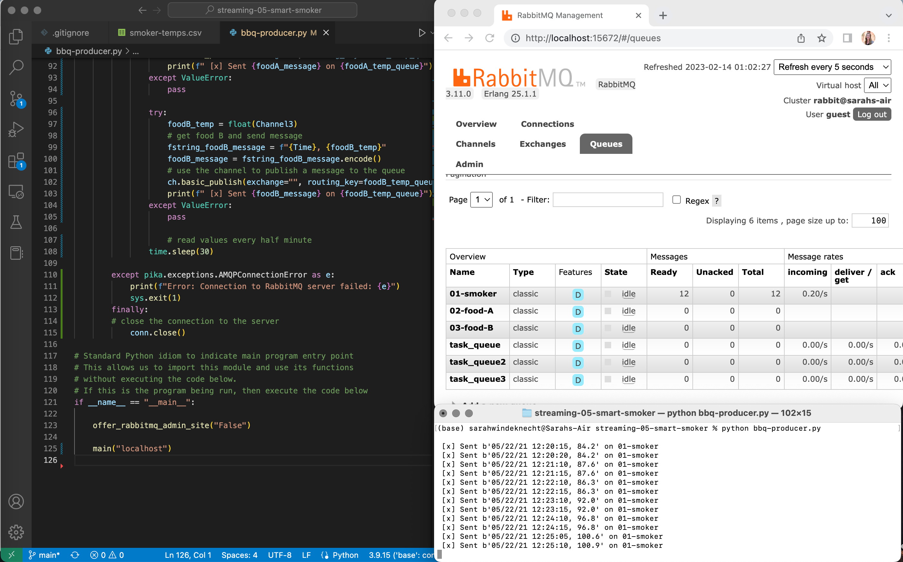

## streaming-05-smart-smoker
# Sarah Windeknecht
February 14, 2023

The Smart Smoker program reads a csv file and creates a producer with three task-queues.

The program simulates a streaming series of temperature readings from a smart smoker and two foods, reading the temperatures every half minute.

The smoker-temp.csv file has four columns:
    [0] Date-time stamp
    [1] Smoker temperature
    [2] Food A temperature
    [3] Food B temperature

We want know if:

The smoker temperature decreases by more than 15 degrees F in 2.5 minutes.
Any food temperature changes less than 1 degree F in 10 minutes.

## Prerequisites

RabbitMQ server running

Pika installed in the active Python environment

## Running the Program

1. Open Terminal
2. Run bbq-producer.py

To open the RabbitMQ Admin page, set show_offer = "False", or set show_offer = "True" to be given the option.

## Screenshot

See a running example with at least 3 concurrent process windows here:

